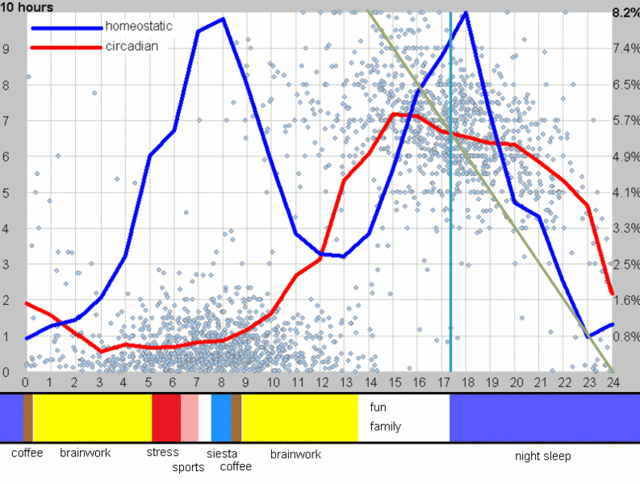

[Artigo Otimizando o tempo do trabalho cerebral](https://supermemo.guru/wiki/Optimizing_the_timing_of_brainwork)

<!-- <h1 style="text-align:center;">Introdução:</h1> -->
### Introdução

O desempenho mental varia ao longo do dia, influenciado por diversos fatores como ritmo circadiano, sono, nutrição e estado emocional. Compreender e otimizar o momento do trabalho cerebral pode aumentar significativamente a produtividade e a retenção de informações.

#### **Gráfico Circadiano e Trabalho Cerebral:**

O ritmo circadiano é um ciclo natural de 24 horas que regula diversos processos fisiológicos, incluindo o sono, a vigília e a cognição. O gráfico circadiano individual varia de pessoa para pessoa, mas geralmente apresenta picos de desempenho mental em duas fases:

- **Manhã:** Ideal para tarefas que exigem foco, atenção e lógica, como resolução de problemas, leitura e escrita. Níveis de cortisol e testosterona aumentam, levando a um maior estado de alerta e melhor desempenho em tarefas que exigem atenção e foco.
- **Tarde:** Período de alta energia e criatividade, favorável para atividades que demandam brainstorming, planejamento e resolução criativa de problemas. Níveis de cortisol diminuem, enquanto a melatonina começa a aumentar. A capacidade de concentração pode diminuir, tornando-a ideal para tarefas criativas ou que exigem menos foco.
- **Noite:** Níveis de melatonina aumentam, promovendo o sono. O trabalho mental pode ser mais difícil e menos produtivo.

#### **Melhor Momento para o Trabalho Cerebral:**

O melhor momento para o trabalho cerebral depende do seu ritmo circadiano individual e das tarefas a serem realizadas. No entanto, estudos sugerem que a maioria das pessoas tem melhor desempenho em tarefas cognitivas durante a manhã.

**Fatores a considerar:**

- Cronotipo: Pessoas "matutinas" tendem a ter melhor desempenho pela manhã, enquanto pessoas "noturnas" podem ser mais produtivas à noite.
- Tarefa: Tarefas que exigem atenção e foco podem ser melhor realizadas pela manhã, enquanto tarefas criativas podem ser mais adequadas para a tarde ou noite.
- Preferências individuais: Algumas pessoas simplesmente preferem trabalhar em determinados horários do dia, independentemente de outros fatores.
- Pessoas matutinas: Tendem a ter melhor desempenho mental pela manhã, logo após acordar.
- Pessoas vespertinas: Apresentam maior pico de energia e foco à tarde.
- Cotovias: Despertam cedo e se sentem mais alertas pela manhã.
- Corujas: Preferem dormir e acordar mais tarde, tendo melhor desempenho à noite.

#### **Ciclo Natural da Criatividade:**

O ciclo natural de criatividade segue um ritmo circadiano, com picos de criatividade pela manhã e à noite.
**Fatores que influenciam a criatividade:**

- Preparação: Coleta de informações e ideias.
- Incubação: Processamento inconsciente das informações.
- Iluminação: Momento de insight e geração de ideias.
- Verificação: Refinamento e avaliação das ideias.
- Sono: Dormir o suficiente é essencial para a criatividade.
- Humor: Um bom humor pode aumentar a criatividade.
- Ambiente: Um ambiente tranquilo e inspirador pode estimular a criatividade.

#### **Ciclo Equilibrado de 24 Horas:**

Para otimizar o trabalho cerebral, é importante manter um ciclo equilibrado de 24 horas, incluindo:

- Sono regular: Dormir de 7 a 8 horas por noite é crucial para a saúde mental e o desempenho cognitivo.
- Alimentação saudável: Consumir alimentos nutritivos que fornecem energia e suporte para o cérebro.
- Exercícios físicos: A prática regular de exercícios melhora a circulação sanguínea, a oxigenação do cérebro e a função cognitiva.
- Gerenciamento do estresse: O estresse crônico pode prejudicar o aprendizado e a memória. Técnicas de relaxamento como meditação e yoga podem ajudar a reduzir o estresse.

#### **Dormindo Contra o Ritmo Natural:**

Dormir contra o ritmo natural pode ter efeitos negativos no desempenho mental, como:

- Fadiga: Sensação de cansaço e falta de energia.
- Dificuldade de concentração: Incapacidade de se concentrar em tarefas por longos períodos.
- Humor instável: Maior irritabilidade e propensão a mudanças de humor.
- Diminuição da produtividade: Menor rendimento no trabalho e nos estudos.

**Consequências de dormir contra o ritmo natural:**

- Fadiga
- Dificuldade de concentração
- Aumento do risco de doenças
- Diminuição da produtividade

**Dicas para dormir de acordo com o ritmo natural:**

- Exponha-se à luz solar natural durante o dia.
- Evite a luz azul à noite.
- Estabeleça uma rotina regular de sono.
- Crie um ambiente relaxante para dormir.

| Estado                               |  **Sonolência Circadiana Elevada**                                                                                   |  **Sonolência Circadiana Baixa**                                           |
|--------------------------------------|---------------------------------------------------------------------------------------------|--------------------------------------------------|
|  |                                                                                             |                                                  |
| Sonolência Homeostática Elevada    | Pico da noite: Muito sonolento, sono refrescante com latência < 5 min.                      | Aguardar a fase circadiana; atrasar o sono.      |
|      | Hipersônia: Sonolento durante o dia, longas horas de sono.                                  | Ajustar a fase de sono ao circadiano.     |       |
|     |                                                                                             |                                                  |
|  Sonolência Homeostática Baixa   | Insônia: Cansado mas não consegue dormir, temperatura e pressão elevadas.                   | Atrasar o sono em 3-6 horas.                     |
|     | Pico do dia: Alerta, energético, cheio de novas ideias.                                     |                                                  |

>  **Figura:** **Otimizando o tempo do trabalho cerebral em relação ao [ciclo circadiano](https://supermemo.guru/wiki/Circadian_cycle "Circadian cycle")**. Este gráfico foi gerado com a ajuda do [SleepChart](https://supermemo.guru/wiki/SleepChart "SleepChart") com base em medições diárias de 3 anos de um ritmo de [sono de corrida livre](https://supermemo.guru/wiki/Free-running_sleep "Free-running sleep"). O eixo horizontal expressa o número de horas [a partir do despertar](https://supermemo.guru/wiki/Circadian_phase "Circadian phase") (note que o período do ciclo [de sono livre](https://supermemo.guru/wiki/Free-running_sleep "Free-running sleep") pode ser maior que 24 horas). Pontos azuis claros são medidas reais de episódios de sono com o tempo na horizontal e o comprimento no eixo vertical esquerdo. **[A sonolência homeostática](https://supermemo.guru/wiki/Homeostatic "Homeostatic")** pode ser expressa aproximadamente como a **capacidade de iniciar o sono**. A porcentagem dos episódios de sono iniciados é pintada como uma linha azul espessa (calibrações do lado direito do eixo vertical). A [propensão ao sono homeostático](https://supermemo.guru/wiki/Homeostatic_sleep_propensity "Homeostatic sleep propensity") relacionada à adenosina aumenta em proporção ao esforço mental e pode ser parcialmente eliminada pela cafeína, estresse, etc. A sonolência **[circadiana](https://supermemo.guru/wiki/Circadian "Circadian")** pode ser expressa aproximadamente como **a capacidade de manter o sono**. A duração média dos episódios de sono iniciados é pintada como uma linha vermelha espessa (calibrações do lado esquerdo do eixo vertical). A queda no estado de alerta do meio do dia também é circadiana, mas é biologicamente diferente e resulta em sono curto que não se registra como um pico vermelho. O componente circadiano **de manutenção** do sono correlaciona-se (1) negativamente com temperatura corporal central, [ACTH](https://en.wikipedia.org/wiki/ACTH), [cortisol](https://en.wikipedia.org/wiki/Cortisol), [catecolaminas](https://en.wikipedia.org/wiki/Catecholamine) e (2) positivamente com: [melatonina](https://supermemo.guru/wiki/Melatonin "Melatonin") e propensão [ao sono REM](https://supermemo.guru/wiki/REM_sleep "REM sleep"). **O momento ideal do trabalho cerebral** requer (1) baixa sonolência [homeostática](https://supermemo.guru/wiki/Homeostatic "Homeostatic") e (2) baixa sonolência [circadiana](https://supermemo.guru/wiki/Circadian "Circadian"). Há dois blocos de alerta de alta qualidade durante o dia: o primeiro após o despertar e o segundo após a [sesta](https://supermemo.guru/wiki/Siesta "Siesta"). Ambos os blocos são marcados como faixas amarelas abaixo do gráfico. Para melhor aprendizado, e para melhor [criatividade](https://supermemo.guru/wiki/Creativity "Creativity"), use esses dois blocos amarelos de tempo. [A cafeína](https://supermemo.guru/wiki/Caffeine "Caffeine") só pode ser usada para melhorar o estado de alerta no início da janela ideal do cérebro (marrom). O uso posterior afetará o sono (a meia-vida da cafeína é de cerca de seis horas). O momento ideal do exercício não é marcado, pois pode variar dependendo do momento ideal dos [zeitgebers](https://supermemo.guru/wiki/Zeitgeber "Zeitgeber") (por exemplo, de manhã cedo para pessoas [DSPS](https://supermemo.guru/wiki/DSPS "DSPS") e à noite para pessoas ASPS). Para mais detalhes ver: [Natureza bifásica do sono humano](https://supermemo.guru/wiki/Biphasic_life "Biphasic life")

**Conclusão:**

Compreender e otimizar o momento do trabalho cerebral pode trazer benefícios significativos para a produtividade, a retenção de informações e a saúde mental. Otimizar o momento do trabalho mental pode melhorar significativamente o desempenho e a produtividade. Ao compreender o gráfico circadiano, o ciclo natural de criatividade e a importância de um ciclo de 24 horas equilibrado, você pode identificar os melhores horários para realizar suas tarefas mentais e alcançar seus objetivos.

| Termo                   | Definição                                                                                                                                                                                |
| ----------------------- | ---------------------------------------------------------------------------------------------------------------------------------------------------------------------------------------- |
| Ciclo circadiano        | Um ciclo interno de aproximadamente 24 horas que regula muitos processos fisiológicos e comportamentais, como sono, vigília, temperatura corporal, hormônios e desempenho mental.        |
| Sonolência homeostática | A necessidade de dormir que aumenta com o tempo que você está acordado. É como um "medidor de sono" que se acumula durante o dia e precisa ser zerado com o sono.                        |
| Melatonina              | Um hormônio produzido pela glândula pineal no cérebro que ajuda a regular o sono. Os níveis de melatonina aumentam à noite e diminuem durante o dia, promovendo o ciclo de sono-vigília. |
| Sono REM                | A fase do sono caracterizada por movimentos rápidos dos olhos e intensa atividade cerebral. É durante o sono REM que a maioria dos sonhos ocorre.                                        |
| Sesta                   | Um período curto de sono, geralmente durante o dia, que pode ajudar a melhorar o estado de alerta e o desempenho mental.                                                                 |
| Zeitgebers              | Fatores externos que sincronizam o relógio circadiano com o ambiente, como luz solar, horários de refeições e atividades sociais.                                                        |
| ACTH                    | O hormônio adrenocorticotrópico, secretado pela hipófise, que estimula as glândulas suprarrenais a liberar cortisol.                                                                     |
| Cortisol                | Hormônio relacionado ao estresse e ao ciclo circadiano.                                                                                                                                  |
| Catecolaminas           | Um grupo de hormônios, incluindo adrenalina e noradrenalina, que são liberados em resposta ao estresse e aumentam a frequência cardíaca, a pressão arterial e a respiração.              |
| Pessoas DSPS            | Indivíduos com Síndrome da Fase do Sono Atrasada, dificuldade em adormecer e acordar cedo.                                                                                               |

